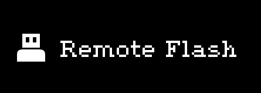
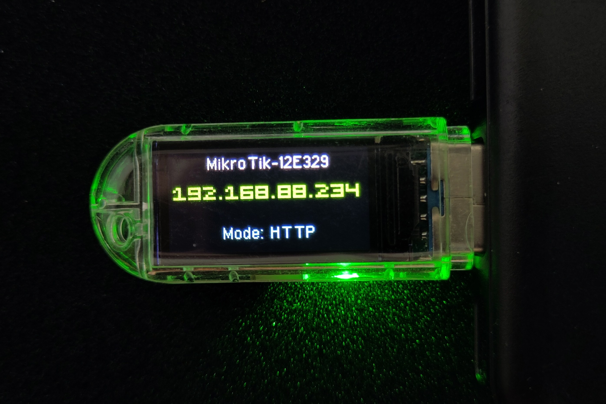
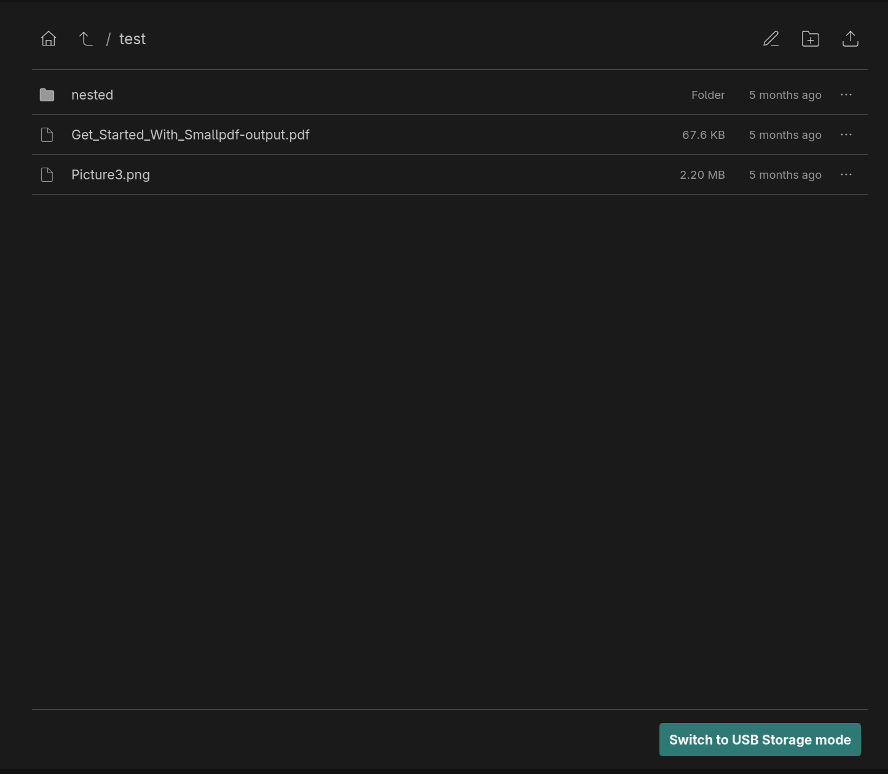
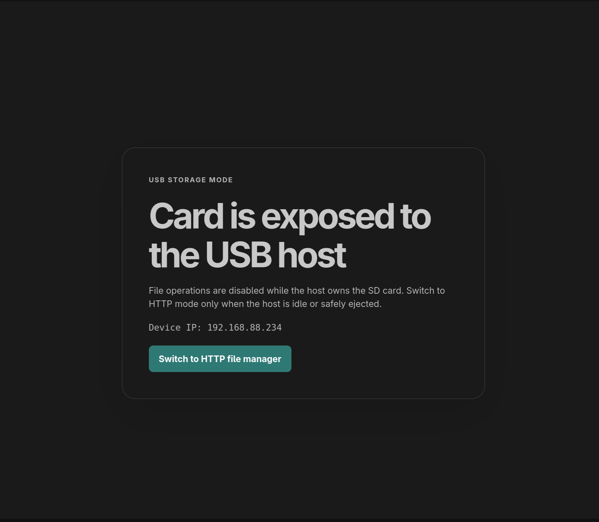

# Remote Flash

Remote Flash turns a [LILYGO T-Dongle S3](https://lilygo.cc/en-us/products/t-dongle-s3) into a USB flash drive that can be managed over Wi-Fi from a web browser.

The device has two modes:

- HTTP mode: manage files on the SD card through the web UI.
- USB mode: expose the SD card to the connected USB host as a regular flash drive.

## How to Use It

1. Plug the dongle into the USB-A port of the target device that should receive the files.
2. Wait for the dongle to connect to Wi-Fi. Its display will show an IP address.
3. Open that IP address in a browser on the device you want to transfer files from.
4. Upload the required files through the web UI.
5. In the same web UI, switch the dongle to USB mode. The uploaded files will then be available to the target device as files on a flash drive.

On first boot, you must configure Wi-Fi before the web UI becomes available.



## How to Configure Wi-Fi

If Wi-Fi credentials have not been configured yet, the dongle creates a `wifi.cfg` file on the SD card and stops on the setup screen.

Connect the dongle to a computer, open the removable drive, and edit `wifi.cfg`:

```ini
ssid=YOUR_WIFI_NETWORK
password=YOUR_PASSWORD
```

Replace the placeholder values with your Wi-Fi network name and password, save the file, eject the drive, and re-attach the dongle.

The dongle supports 2.4 GHz Wi-Fi networks only. If your router uses separate names for 2.4 GHz and 5 GHz networks, use the 2.4 GHz SSID.

After a successful connection, the credentials are saved to internal memory and `wifi.cfg` is removed from the SD card. To change the network later, create a new `wifi.cfg` in the SD card root with the same format and reboot the dongle.




## Limitations
Hardware supports only USB Full-Speed - it's about 600-640 kB/s witch is pretty slow and not suited for transfer files more than 100MB
