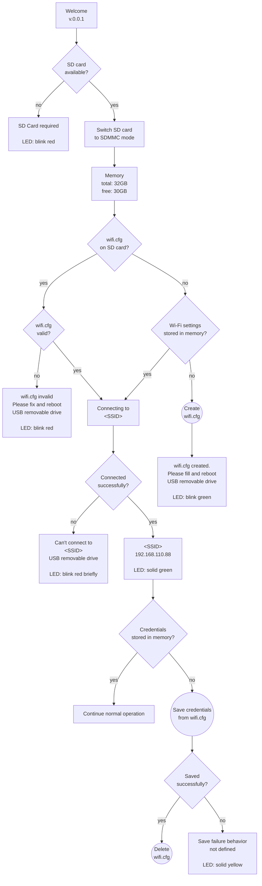

# Startup and Wi-Fi Configuration Flow

## Technical Specification

**Version:** `v0.0.1`

The device shall execute the following startup logic after boot.

### 1. Welcome Screen

On startup, the device shall display:

```text
Welcome
v.0.0.1
```

### 2. SD Card Check

The device shall check whether an SD card is available.

If the SD card is not available:

- Display:

```text
SD Card required
```

- The LED indicator shall blink red.
- The startup process shall stop.

If the SD card is available:

- Switch the SD card interface to SDMMC mode.
- Display SD card memory information:

```text
Memory
total: <total_size>
free: <free_size>
```

Example:

```text
Memory
total: 32GB
free: 30GB
```

### 3. Wi-Fi Configuration File Check

The device shall check whether `wifi.cfg` exists on the SD card.

If `wifi.cfg` exists:

- Validate the file format and credentials.

If `wifi.cfg` is invalid:

- Display:

```text
wifi.cfg invalid
Please fix and reboot
```

- The LED indicator shall blink red.
- The SD card shall be exposed to the USB host as a removable drive.
- The startup process shall wait for reboot.

If `wifi.cfg` is valid:

- Use the credentials from `wifi.cfg`.
- Continue to Wi-Fi connection.

### 4. Missing `wifi.cfg`

If `wifi.cfg` does not exist on the SD card, the device shall check whether Wi-Fi credentials are already stored in internal memory.

If credentials exist in internal memory:

- Use the stored credentials.
- Continue to Wi-Fi connection.

If credentials do not exist in internal memory:

- Create a default `wifi.cfg` file on the SD card.
- Display:

```text
wifi.cfg created.
Please fill and reboot
```

- The LED indicator shall blink green.
- The SD card shall be exposed to the USB host as a removable drive.
- The startup process shall wait for reboot.

### 5. Wi-Fi Connection

When valid credentials are available, the device shall display:

```text
Connecting to
<SSID>
```

The device shall attempt to connect to the specified Wi-Fi network.

If the connection fails:

- Display:

```text
Can't connect to
<SSID>
```

- The LED indicator shall blink red briefly.
- The SD card shall be exposed to the USB host as a removable drive.
- The startup process shall continue in USB mode without the HTTP server.

If the connection succeeds:

- Display the connected SSID and assigned IP address:
- The LED indicator shall be solid green.

```text
<SSID>
<IP_ADDRESS>
```

Example:

```text
<SSID>
192.168.110.88
```

### 6. Credential Persistence

After a successful Wi-Fi connection, the device shall check whether the currently used credentials are already stored in internal memory.

If the credentials are already stored:

- No additional action is required.

If the credentials are not stored:

- Save credentials from `wifi.cfg` into internal memory.
- Check whether saving was successful.

If saving succeeds:

- Delete `wifi.cfg` from the SD card.

If saving fails:

- The LED indicator shall be solid yellow.
- The device shall keep `wifi.cfg` on the SD card.
- Additional recovery behavior is not defined in the diagram and should be specified separately.

## Mermaid Diagram


